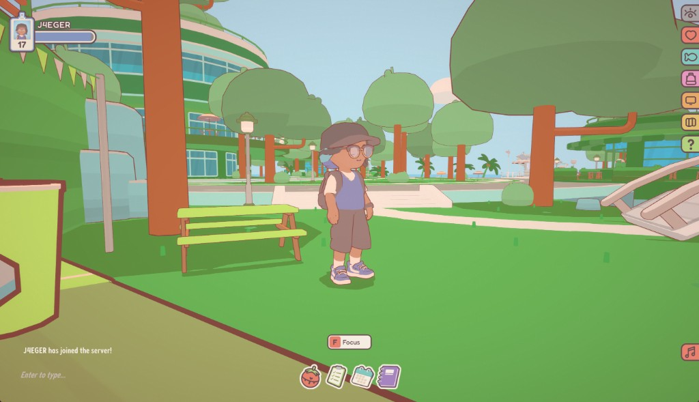

# Frutiger Aero Recolor

A **client-side** BepInEx mod for [On-Together: Virtual Co-Working](https://store.steampowered.com/app/3837230/OnTogether_Virtual_CoWorking/) that recolors the park environment toward a **Frutiger Aero** look: lush outdoor greens, cream-white structure, aqua glass/water accents, and soft white paths.

Works on **public servers** — only you see the recolor; other players see default colors unless they install this mod too.



> **Status:** Source and releases are on **GitHub only** for now. A [Thunderstore](https://thunderstore.io/c/on-together/) listing is planned but not published yet.

## Requirements

- [On-Together](https://store.steampowered.com/app/3837230/OnTogether_Virtual_CoWorking/)
- [BepInEx Pack](https://thunderstore.io/c/on-together/p/BepInEx/BepInExPack/) for On-Together

## Install (from GitHub)

Paths below are relative to your **On-Together game folder** (Steam) or **Thunderstore Mod Manager profile** — wherever your `BepInEx` folder lives.

1. Clone or download this repository.
2. Build the DLL (see **Build from source** below) or use one you already built.
3. Copy `FrutigerAeroRecolor.dll` into any folder under `BepInEx/plugins/`. For example:

   `BepInEx/plugins/FrutigerAeroRecolor/FrutigerAeroRecolor.dll`

   BepInEx loads plugins from subfolders; the folder name does not need to match the mod ID or author.

4. Launch On-Together through BepInEx (or your mod profile).

After first launch, config is created at:

`BepInEx/config/io.j4eger.ontogether.frutigeraerorecolor.cfg`

That filename comes from the mod's internal ID and is the same for every player — not from your plugin folder name.

Confirm in `BepInEx/LogOutput.log`:

`FrutigerAeroRecolor 1.5.10 loaded`

### Thunderstore (coming soon)

When published, install with [Thunderstore Mod Manager](https://thunderstore.io/c/on-together/) — it will place files automatically. Until then, use the GitHub steps above.

## In-game settings

Press **Keypad 5** to open the settings panel.

| Button | Effect |
|--------|--------|
| **Eye Comfort Preset** | Softer greens, cream stone cliffs, balanced vibrancy (recommended) |
| **Reset to Recommended Defaults** | Brighter foliage and glass accents |
| **Cliff face style** | Cream stone (default) or soft aqua |

## What gets recolored

This mod targets materials the base game draws via **GPU instancing** (buildings, grass, trees, bushes, paths) plus remaining world renderers.

- **Circle Mountain building** — cream/white structure bands
- **Tiered hills** — lush green foliage tones
- **Trees, bushes, grass bases** — vibrant but capped greens
- **Paths & decks** — soft white walkways
- **Props** — warm wood and cream accents
- **Cliffs / terraces** — cream stone by default

## Multiplayer

- **Client-side only** — no server install required
- Each player who wants the look must install the mod locally

## Build from source

Requirements: [.NET SDK](https://dotnet.microsoft.com/download) (builds `net472`), On-Together + BepInEx installed.

1. Clone this repo
2. Copy `local.paths.props.example` → `local.paths.props` and set `GameDir` / `BepInExDir`
3. Build:

```bash
dotnet build -c Release
```

Output: `bin/Release/net472/FrutigerAeroRecolor.dll`

## Optional pairing

Pairs well with [ShaderPlayground](https://thunderstore.io/c/on-together/p/YenRex/ShaderPlayground/) for sky/bloom — not required.

## For maintainers: Thunderstore package

Packaging files for a future Thunderstore upload live in `thunderstore/`. From the repo root:

```powershell
.\scripts\build-thunderstore.ps1
```

Creates `dist/J4EGER-FrutigerAeroRecolor-<version>.zip` when you are ready to publish.

## License

MIT — see [LICENSE](LICENSE).

## Author

**J4EGER** — report issues on [GitHub](https://github.com/jaredescott/On-Together-FrutigerAeroRecolor/issues)
